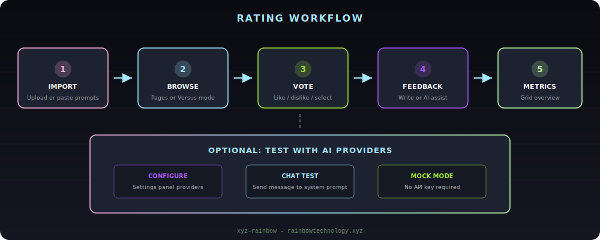

# xyz-prompt — Prompt Rating SPA

> Rate, compare, and analyze LLM system prompts with Pages, Versus A/B, and Metrics modes. Local-first IndexedDB persistence, multi-provider AI configuration, and ES/EN i18n.

[](https://nodejs.org/)
[](https://react.dev/)
[](https://vitejs.dev/)
[](LICENSE)

**Repository:** [github.com/RainbowKolors/xyz-prompt](https://github.com/RainbowKolors/xyz-prompt)

---

## Requirements

| Component | Details |
|-----------|---------|
| Runtime | Node.js >= 20 |
| Package manager | npm |
| Browser | Modern Chromium, Firefox, or Safari (IndexedDB required) |

---

## Quick Start

```bash
git clone https://github.com/RainbowKolors/xyz-prompt.git
cd xyz-prompt
npm install
npm run dev
```

Open [http://localhost:3000](http://localhost:3000).

### Production build

```bash
npm run build
npm run preview
```

### Other scripts

| Command | Description |
|---------|-------------|
| `npm run lint` | TypeScript check (`tsc --noEmit`) |
| `npm run clean` | Remove `dist/` |

---

## Architecture


The app is a client-side SPA with no backend server:

- **Ingestion** — import prompts via file upload (`.md`, `.txt`, `.json`, `.csv`, `.docx`, `.pdf`) or clipboard paste.
- **Zustand** — global UI state: active mode, i18n language, votes, chat messages, provider settings.
- **Dexie (IndexedDB)** — persistent storage for prompts, votes, feedbacks, and AI provider profiles.
- **AI layer** — mock responses by default; optional real providers (OpenAI-compatible, Anthropic, Google, Ollama, LM Studio, etc.).
- **React UI** — `ChatShell` hosts three views: **Pages**, **Versus A/B**, and **Metrics Grid**.

---

## Rating Workflow



1. **Import** — add prompts from files or paste.
2. **Browse** — review in Pages mode or compare pairs in Versus.
3. **Vote** — like (lime), dislike (purple), or select for feedback.
4. **Feedback** — write comments manually or with AI-assisted suggestions.
5. **Metrics** — overview in a 3×3 grid with hover previews and detailed popups.

Optional: configure AI providers in Settings and send chat messages to test the active system prompt.

---

## Features

- **Three rating modes** — Pages (pagination), Versus (random A/B pairs), Metrics (grid dashboard).
- **Local-first** — all data stored in IndexedDB; works offline after first load.
- **i18n** — Spanish and English UI.
- **Hover sidebar** — opens on left-edge hover; auto-closes when opened by hover and mouse leaves.
- **Multi-provider AI** — builtin presets + custom OpenAI-compatible endpoints; mock mode for no API key.
- **File import** — `.md`, `.txt`, `.json`, `.csv`, `.docx`, `.pdf` via `fileParser` + mammoth.
- **RGB shell UI** — animated border, floating sidebars, keyboard shortcut `Ctrl+B` for sidebar toggle.

---

## API Keys & Security

Provider API keys are stored **in the browser IndexedDB** (`providers` table), not in source code or environment files by default.

- Do **not** commit `.env`, `.env.local`, or any file containing API keys.
- See [`.env.example`](.env.example) for optional future build-time variables (commented placeholders only).
- Cloud provider APIs may fail from the browser due to CORS; local providers (Ollama, LM Studio) work best.

---

## Repository Layout

```
xyz-prompt/
├── index.html
├── package.json
├── vite.config.ts
├── resources/
│   └── assets/              # README SVG diagrams
│       ├── header.svg
│       ├── architecture.svg
│       └── workflow.svg
├── src/
│   ├── App.tsx
│   ├── main.tsx
│   ├── index.css
│   ├── types.ts
│   ├── db/schema.ts         # Dexie schema
│   ├── store/useStore.ts    # Zustand global state
│   ├── i18n/translations.ts
│   ├── services/
│   │   ├── aiService.ts
│   │   ├── providerApi.ts
│   │   └── fileParser.ts
│   ├── lib/providers/
│   ├── components/
│   │   ├── layout/          # ChatShell, sidebars, settings
│   │   ├── prompts/         # Add / edit popups
│   │   ├── rate/            # VoteBar, FeedbackComposer
│   │   ├── chat/            # OutputList, SettingsBall
│   │   ├── settings/        # AI provider config
│   │   └── metrics/         # MetricsPopup
│   └── views/               # Pages, Versus, Metrics
├── CONTRIBUTING.md
├── LICENSE
└── .env.example
```

---

## Contributing

See [CONTRIBUTING.md](CONTRIBUTING.md) for setup, conventions, and the pull request checklist.

---

## License

Licensed under the [Apache License 2.0](LICENSE).
